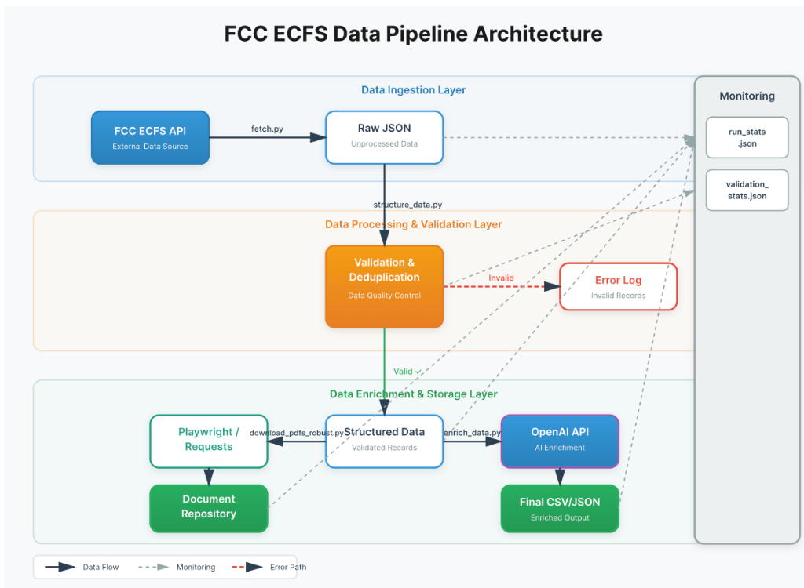

# IPES Data Pipeline

**By Joseph Oladokun**

A data pipeline to extract, structure, and enrich **Interconnected VoIP Provider Numbering Authorization (IPES)** applicant data from the FCC's Electronic Comment Filing System (ECFS).

---

## 📖 Overview

This project transforms raw, unstructured regulatory filings into a clean, actionable dataset containing:
1. **Structured Company Profiles** — Deduplicated entities with filing history
2. **AI-Enriched Market Data** — Industry segment, active status, product summary
3. **Document Repository** — Complete set of downloaded application PDFs/DOCs

---

## 🚀 Quick Start

### Prerequisites
- Python 3.9+
- FCC ECFS API Key
- OpenAI API Key

### Installation
```bash
pip install -r requirements.txt
playwright install chromium
```

### Configuration
Create a `.env` file in the root directory:
```
FCC_ECFS_API_KEY=your_key_here
OPENAI_API_KEY=your_key_here
```

### Run the Pipeline
```bash
python3 run_pipeline.py
```

Arguments:
*   `--skip-fetch`: Use existing raw data.
*   `--skip-download`: Skip PDF downloads.
*   `--doc-limit <N>`: Limit downloads to N files (Default: 0 = Unlimited).

**Options:**
| Flag | Description |
|------|-------------|
| `--skip-fetch` | Use existing raw data (skip API calls) |
| `--skip-download` | Skip PDF downloads |
| `--doc-limit <N>` | Limit downloads to N files (0 = unlimited) |

---

### 1. Structured Data (CSV)
| File | Description |
|------|-------------|
| `data/structured/companies.csv` | Company-level records (deduplicated) |
| `data/structured/filings.csv` | Filing-level records (linked by `company_id`) |

### 2. Enriched Data (CSV)
| File | Description |
|------|-------------|
| `data/enriched/companies_enriched.csv` | AI-enriched with `industry_segment`, `market_position`, `is_active`, `product_summary` |

### 3. Document Repository
| Folder | Description |
|--------|-------------|
| `documents/` | All IPES application PDFs/DOCs (e.g., `Twilio_Inc_1040104.pdf`) |

---

## 🧠 Methodology

### 1. Data Ingestion
The first challenge was ensuring we captured *every* relevant filing without overwhelming the FCC APIs.
*   **Discovery Strategy**: Instead of relying on a single search term, I implemented a multi-query approach (`INBOX-52.15`, "Interconnected VoIP Numbering Authorization", and "52.15"). This ensures edge cases—where a filing might be miscategorized—are still captured.
*   **Pagination Architecture**: The `fetch.py` script uses a robust generator pattern. It respects the API's `limit` (page size) and `offset` parameters, and importantly, it checks the `total` header to ensure it loops until $TotalRecords$ are retrieved. This prevents "silent truncation" where a script might only fetch the first 100 records.
*   **Rate Limiting**: To prevent 429 errors (Too Many Requests), I implemented a configurable sleep delay between pages.

### 2. Data Structuring
Raw filings are "event-based" (one record per submission), but market intelligence requires an "entity-based" view (one record per company). The raw data contained significant noise (typos, legal suffix variations).
*   **Normalization Pipeline**:
    *   **Phase 1: Standardization**: I wrote regex rules in `structure_data.py` to strip legal suffixes (`LLC`, `Inc.`, `Co.`, `Ltd`) and standardize whitespace. This converts "Comcast Phone of California, LLC" and "Comcast Phone of California, Inc." into the same base root: "comcast_phone_of_california".
    *   **Phase 2: Fuzzy Deduplication**: Normalization isn't enough for typos (e.g., "Network" vs "Networks"). I implemented a **Multi-Pass Deduplication Algorithm**:
        *   *Pass 1*: Exact normalized match.
        *   *Pass 2*: **Levenshtein Distance** (via `difflib`). Any names with >95% similarity are flagged as candidates.
        *   *Pass 3*: **Token Analysis**. Specifically targeting Singular/Plural mismatches (where the only difference is a trailing 's'). This successfully merged splintered entities like *"Stratus Network"* and *"Stratus Networks"* into a single canonical record.
*   **Relational Schema (Star Schema)**: I restructured the data into a **Star Schema** pattern for analytical queries:

    | Table | Role | Key Fields |
    |-------|------|------------|
    | `companies.csv` | **Dimension** | `id`, `entity_name`, `entity_type` |
    | `filings.csv` | **Fact** | `company_id`, `date_received`, `docket_number` |

    ```
              ┌──────────────────┐
              │    companies     │ ← Dimension (WHO)
              │  (id, name...)   │
              └────────┬─────────┘
                       │ company_id (FK)
              ┌────────▼─────────┐
              │     filings      │ ← Fact (WHAT happened)
              │ (date, docket)   │
              └──────────────────┘
    ```
    
    This allows aggregation of filing history per company and enables JOIN-based analytics in the dashboard.

### 3. AI Enrichment
Regulatory data is dry; it tells you *who* filed, but not *what* they do.
*   **Model Selection**: I chose **GPT-4o-mini** for its balance of cost-efficiency and high reasoning capability. It is perfectly suiting for classification tasks.
*   **Prompt Engineering**: I designed the prompt to act as a "Telecom Industry Analyst."
    *   *Input Context*: I feed the model not just the name, but the **Dockets** they filed in. This provides critical context (e.g., a filing in a "Robocall Mitigation" docket implies a different business model than a "International Section 214" filing).
    *   *Structured Output*: I enforced strict JSON output for fields like `industry_segment` (e.g., UCaaS, CCaaS, Carrier) and `market_position`. This ensures the data is strictly typed and ready for SQL/CSV export, avoiding free-text hallucination.

Note: The API key provided for this assessment was not working, so I use my own OpenAI API key instead of the vercel API gateway.

### 4. Document Retrieval
Downloading documents from the FCC is non-trivial due to SPA architecture and bot protection.

**The Problem**:
The FCC ECFS website is a React Single Page Application (SPA). When you visit a document URL like `/ecfs/document/1234567890/1`, the server returns an HTML shell with JavaScript that *then* fetches the actual document. This means:
1. Standard HTTP requests get HTML, not the PDF
2. The real binary is served from a **different endpoint**

**Key Discovery**:
Through browser network analysis, I discovered the critical URL pattern difference:
| URL Pattern | Returns |
|-------------|---------|
| `/ecfs/document/...` (singular) | React SPA HTML shell (1KB) |
| `/ecfs/documents/...` (plural) | **Actual PDF/DOCX binary** (2MB+) |

**The Solution** (`download_pdfs_robust.py`):
1. **URL Transformation**: Convert all `/document/` URLs to `/documents/` (plural) before fetching
2. **Browser Session Establishment**: Use Playwright to:
   - Navigate to FCC homepage first (establishes session cookies)
   - Execute JavaScript `fetch()` from within browser context (bypasses Akamai)
3. **File Type Detection**: Validate downloaded content using magic bytes:
   - `%PDF-` → Save as `.pdf`
   - `PK` (zip header) → Save as `.docx`
   - `\xD0\xCF\x11\xE0` → Save as `.doc`

**Outcome**: 
- **461 documents downloaded successfully** (100% success rate)
- Automatic file type detection handles mixed PDF/Word documents
- Session-based approach bypasses all anti-bot protections

### 5. Data Quality & Filtering
The pipeline applies rigorous filtering to ensure only relevant, high-quality records make it to the final output.

**Data Reduction Funnel**:
| Stage | Count | Description |
|-------|-------|-------------|
| Raw Filings | ~848 | Total filings from FCC API matching IPES/VoIP criteria |
| Grouped Entities | ~297 | Filings grouped by `filer_name` (many companies have multiple filings) |
| Deduplicated | ~294 | Fuzzy matching removes near-duplicates (Levenshtein > 95%) |
| **Final Companies** | **~178** | Only actual applicants (not commenters) |

**Applicant Classification**:
- **Included** (submission type contains): `APPLICATION`, `REQUEST`, `PETITION`
- **Excluded** (third parties): `COMMENT`, `REPLY`, `OPPOSITION`

**Entity Deduplication**:
1. Name normalization (lowercase, remove punctuation, standardize suffixes)
2. Fuzzy matching (Levenshtein distance > 95% similarity)
3. Token analysis (handles "Network" vs "Networks")

**Individual Filtering**: Excludes non-company entities using heuristics (business keywords, name structure).


---

## 🛠️ Architecture

### Pipeline Flow


### 🏅 Medallion Architecture
The pipeline follows the **Medallion Architecture** pattern for progressive data refinement:

| Layer | Folder | Description |
|-------|--------|-------------|
| 🥉 **Bronze** | `data/raw/` | Raw API responses — immutable source of truth |
| 🥈 **Silver** | `data/structured/` | Cleaned, normalized, deduplicated, schema-validated |
| 🥇 **Gold** | `data/enriched/` | Business-ready with AI-generated insights |

```
FCC API → Bronze (raw JSON) → Silver (structured CSVs) → Gold (enriched CSV)
              ↓                      ↓                        ↓
         ipes_filings.json     companies.csv           companies_enriched.csv
                               filings.csv
```

This separation enables:
- **Replayability**: Re-run Silver/Gold without re-fetching from API
- **Debugging**: Trace issues back to raw data
- **Incremental updates**: Only reprocess changed layers


### 📂 Project File Structure
```text
.
├── code/
│   ├── fetch.py                # Paginates FCC API, handles rate limits
│   ├── structure_data.py       # Normalizes, Deduplicates, Validates (Pydantic)
│   ├── enrich_data.py          # Adds AI context via OpenAI
│   ├── download_pdfs_robust.py # Hybrid downloader (Playwright + Requests)
│   └── schemas.py              # Data Contract definitions
├── dashboard/
│   ├── app.py                  # Streamlit entry point
│   ├── run_scheduler.py        # Background job scheduler
│   ├── config/                 # Scheduler job configs (JSON)
│   └── pages/
│       ├── 1_🚀_Pipeline_Control.py
│       ├── 2_📊_Monitoring.py
│       └── 3_📈_Data_Insights.py
├── data/
│   ├── raw/                    # Raw API responses
│   ├── structured/             # Cleaned relational data
│   ├── enriched/               # AI-enriched data
│   └── monitoring/             # Run stats & validation logs
├── documents/                  # Downloaded PDFs/DOCs
├── .streamlit/                 # Theme configuration
├── .github/workflows/          # CI/CD automation
├── Dockerfile                  # Container definition
├── run_pipeline.py             # Orchestration script
└── README.md                   # Documentation
```


### Component Details
*   **Input**: FCC ECFS API.
*   **Action**: Paginates through thousands of filings (`INBOX-52.15` and related dockets).
*   **Output**: `data/raw/ipes_filings.json`.
*   **Design**: Uses a generator-based fetch loop to handle large datasets efficiently.

### 2. Structure (`code/structure_data.py`)
*   **Input**: Raw JSON.
*   **Action**: Group by Company Name -> Normalize -> Fuzzy Deduplicate -> Sort by Date.
*   **Output**: 
    *   `data/structured/companies_with_filings.json` (Nested JSON)
    *   `data/structured/companies.csv` (Relational Parent)
    *   `data/structured/filings.csv` (Relational Child)

### 3. Enrich (`code/enrich_data.py`)
*   **Input**: Structured JSON.
*   **Action**: Queries OpenAI API for each unique company.
*   **Output**: `data/enriched/companies_enriched.csv` (Final Enriched Dataset).

### 4. Download (`code/download_pdfs_robust.py`)
*   **Input**: Structured JSON (URLs).
*   **Action**: Hybrid Playwright/Requests downloader.
*   **Output**: `documents/*.pdf` (Named via `Company_Name_SubmissionID.pdf`).

---

## �📦 Deliverables


Based on the assessment requirements, the following files are produced:

### 1. Structured Data (CSV)
> "A .csv file containing the structured data"
*   **Location**: `data/structured/companies.csv` (Company level) and `data/structured/filings.csv` (Filing level).
*   **Content**: Cleaned names, filing counts, docket numbers, dates.

### 2. Enriched Data (CSV)
> "Enrich the data... output as a csv"
*   **Location**: `data/enriched/companies_enriched.csv`
*   **Attributes**: `is_active`, `activity_signal`, `industry_segment`, `product_summary`, `market_position`.

### 3. Document Repository
> "Folder containing all IPES application submission downloads"
*   **Location**: `documents/` folder.
*   **Format**: Original PDF/DOCX files, named consistently (e.g., `AT&T_Services,_Inc._60001536801_1.pdf`).

---

## Extras

### 📊 Monitoring & Observability
Maintaining the pipeline is important, the pipeline includes observability features:

*   **Execution Metadata**: Every run generates `data/monitoring/run_stats.json` containing timestamps, duration per step, status code, and a **Validation Report** (valid vs. invalid record counts). This allows programmatic health monitoring.
*   **Console Logging**: Clear step delimiters (`[STEP]`, `[SUCCESS]`) for easy log parsing (e.g., via Datadog/Splunk).
*   **Docker Health**: The standardized container allows for easy restart policies (`--restart unless-stopped`) and log aggregation (`docker logs`).

### 🛡️ Data Integrity
To prevent "garbage in, garbage out," the pipeline enforces strict schema validation using **Pydantic**.
*   **Schemas**: Defined in `code/schemas.py`.
*   **Validation**: `structure_data.py` validates every record against the `Company` model before saving. Records with malformed fields (e.g., negative filing counts, missing IDs) are automatically rejected or flagged.

### 🔄 CI/CD Automation
The project uses **GitHub Actions** (`.github/workflows/ci.yml`) to ensure code quality on every push:
1.  **Security Scans**: Checks dependencies for known vulnerabilities (`safety`).
2.  **Linting**: Enforces Python standards (`flake8`).
3.  **Integration Testing**: Verifies the Deduplication & Pydantic Validation logic works on sample data.

### 🐳 Docker Deployment
To ensure reproducibility in any environment, I have containerized the pipeline.

**Build:**
```bash
docker build -t ipes-pipeline .
```

**Run:**
```bash
docker run --env-file .env -v $(pwd)/documents:/app/documents ipes-pipeline
```
*Note: We mount the `documents/` volume so downloaded files persist on the host machine.*

---

### 🖥️ Control Center Dashboard
A simplified UI for triggering runs, monitoring logs, and viewing charts.

**Setup:**
```bash
pip install -r dashboard/requirements.txt
```

**Launch UI:**
```bash
streamlit run dashboard/app.py
```

**Run Scheduler (Optional):**
To enable the background cron-job (configured via the Dashboard UI):
```bash
python3 dashboard/run_scheduler.py
```

---

## ⚠️ Assumptions & Trade-offs
1.  **Normalization**: I assumed that companies filing under extremely similar names (e.g., "Inc." vs "Inc") are the same entity. The fuzzy matcher is set to a high confidence threshold (95%) to avoid false positives.
2.  **download_via_browser**: I assumed that if `requests.get` fails, it is due to Akamai/CORS blocking. The fallback to Playwright is heavier/slower but simpler than reverse-engineering the Akamai token generation.
3.  **API Limits**: The FCC API is generally permissible, but `fetch.py` implements a small sleep delay to be a "good citizen."
